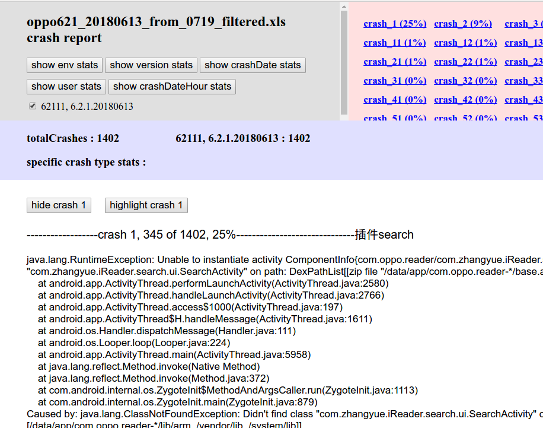

# sortCrashFromExcel
### 准备环境：
- 安装python3.5（项目按照python3.5规范编码)
- 下载该项目并安装各个依赖库: xlrd xlwt progressbar 
### 准备输入文件：
- 准备好崩溃统计excel表，如果有mapping文件的话也可以准备
### 运行：
#### 过滤：
- 运行filter_crash.py来过滤输入的崩溃统计excel表，假设名字为xxx.xls，输出是在其同级目录生成的一个叫xxx_filtered.xls的新表　　
<br>```python3 filter_crash.py(相对或绝对路径) xxx.xls(必须是绝对路径)```
#### 统计：
- 运行sort_crash.py来统计输入的崩溃统计excel表，输出是一个网页（存储在输入的excel表的同级目录下，名字是xxx_filtered.html），会自动打开
<br>```python3 sort_crash.py(相对或绝对路径) xxx_filtered.xls(必须是绝对路径)```　　
- 如果需要反混淆，则可以
<br>```python3 sort_crash.py(相对或绝对路径) xxx_filtered.xls(必须是绝对路径) mapping1.txt mapping2.txt ...(必须是绝对路径，可以输入多个mapping文件，方便插件崩溃的retrace)```
### 配置运行参数：
- 目前所有过滤和统计功能的参数都不支持从外部输入，请在filter_crash.py和sort_crash.py源码中按照注释修改后再运行
### 运行结果:

#### 各按钮作用：
- showEnvStats: 按机型 + Android版本来统计崩溃比例
- showVersionStats: 按versionName + versionCode来统计崩溃比例
- showCrashDateStats: 按崩溃日期来统计崩溃比例
- showUserStats: 按i号来统计崩溃比例
- showCrashDateHourStats: 按崩溃的具体小时时段来统计崩溃比例，以柱状图来显示
- hideCrash xx：隐藏这个crash的统计信息
- highlightCrash xx: 这个crash的信息标红
- 勾选框：只显示勾选的版本的崩溃，未勾选的被隐藏
#### 可自定义的功能：
- 蓝色区域可以按照关键字对崩溃信息进行分类统计，其设定在sort_crash.py中，可调
- 根据崩溃信息中的关键字来识别某个崩溃是主工程的还是某个插件的，其设定在config.py中，可调
